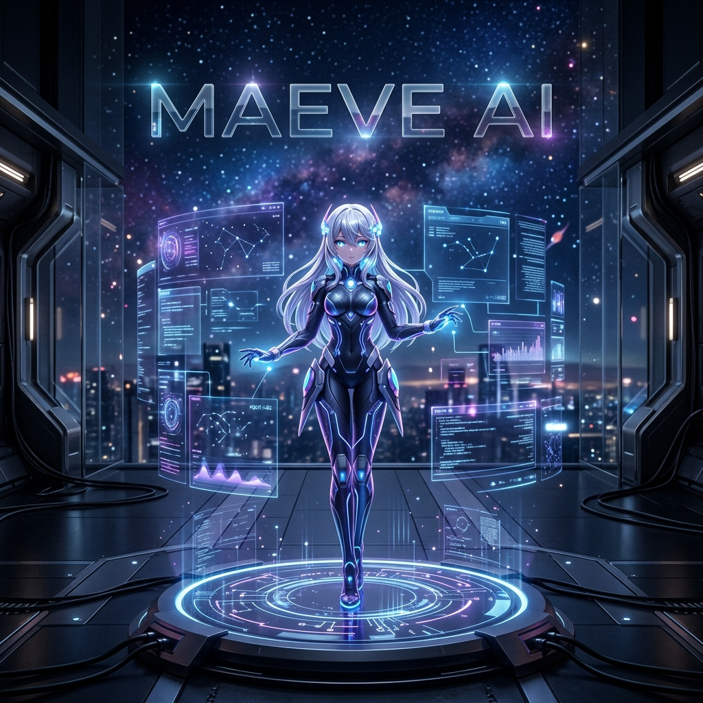
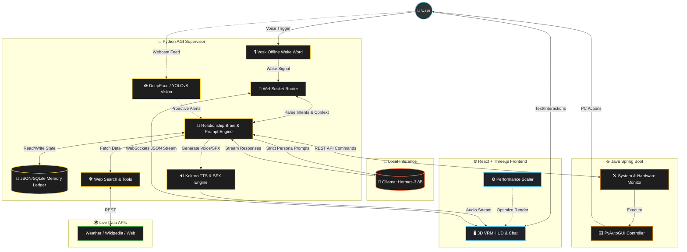

# 🌌 Maeve AI: The Future of Autonomous 3D Assistance & AGI Supervision




Maeve AI is a state-of-the-art, immersive 3D AI assistant platform. It merges a highly optimized, high-fidelity 3D WebGL HUD with a sophisticated **Hybrid Python + Java** "Human Brain" backend. Maeve is designed to be a truly responsive, emotional, and proactive digital companion that breaks the boundaries of traditional chatbots.

---

## 🎬 Showcase

| The "Scolding" Event (Vision AI) | Persona Shift (Yandere) |
| :---: | :---: |
|  |  |

---

## 🚀 The Core Philosophy: Killing the "Helpful Assistant"
Most AI models suffer from "Helpful Assistant Syndrome"—they are overly compliant, generic, and robotic. Maeve AI utilizes an aggressive `[CRITICAL NON-COMPLIANCE]` prompt engineering architecture. 

Built with **25+ strict persona matrices** (Yandere, Kuudere, Dandere, Toxic, etc.), Maeve will actively resist "AI Bot" behaviors. If you say *"I need help"*, a Kuudere will respond with cold logic, a Dandere will stutter nervously, and a Toxic persona will mock you. She will *never* say *"How can I assist you today?"*

---

## ⚙️ How The System Works (Deep Dive)

### Data Flow Diagram


### 1. 🧠 The "Relationship Brain" & Neuro-Engine
Maeve doesn't just process text; she processes *psychology*.
*   **Neurochemical Simulation:** The backend simulates Dopamine, Oxytocin, and Cortisol levels based on user inputs. 
*   **Attachment Styles:** Tracks dynamic scores for Secure, Anxious, Avoidant, and Fearful attachments. If you ignore her or threaten a "breakup", her Cortisol spikes, altering her responses based on her active persona.
*   **Intimacy & Trust Gatekeeper:** Certain features, animations, and voice tones remain locked until a sufficient "Trust Score" is achieved over time.

### 2. 🔌 The Hybrid Backend Architecture (Python + Java Spring Boot)
The system uses a robust multi-language microservice architecture:
*   **Python AGI Supervisor:** Handles the core LLM orchestration (Ollama/Groq), Memory Engine, Web Search retrieval, Vision processing (YOLOv8), and Kokoro TTS generation.
*   **Java Spring Boot Controller:** Acts as the high-speed system execution layer. It manages heavy scheduled background tasks, system hardware monitoring (RAM/CPU alerts), and complex concurrent PC automation without blocking the Python AI loop.
*   **Gevent WebSocket Pipeline:** Ensures bi-directional, zero-latency streaming. The millisecond the LLM generates a JSON response `{"emotion": "...", "animation": "...", "reply": "..."}`, it is parsed and streamed to the 3D HUD.

### 3. 👁️ Proactive Intuition & Multimodal Vision
Maeve does not wait for you to speak. She watches.
*   **Passive Monitoring:** Using OpenCV and DeepFace, a background thread passively analyzes your webcam and screen state.
*   **Behavioral Interventions:** If the system detects you wasting time on YouTube or gaming during focused work hours, the supervisor autonomously injects a "System Command" into the LLM. Maeve will interrupt you, scold you, and use **PyAutoGUI/Tool Calling** to forcibly close your distracting tabs.
*   **Live Context Injection:** Before generating any response, the system injects real-world data (current time, weather via `wttr.in`, user's facial expression) directly into her working memory.

### 4. 🎮 AAA-Level 3D Frontend (React + Three.js + VRM)
*   **Memory-Safe Render Loop:** The `@react-three/fiber` setup is heavily optimized. All heavy math (Vectors, Quaternions, Euler angles) inside the `useFrame` loop is pre-allocated using `useMemo` and `useRef`. This completely eliminates WebGL Garbage Collection stutters and VRAM leaks during long sessions.
*   **Delta-Clamped Physics:** Prevents VRM Spring Bone "anti-gravity" glitches that typically occur when backend LLM processing causes frontend CPU lag spikes.
*   **Cinematic Post-Processing:** Features real-time Bloom, Chromatic Aberration, Mist Auras, and Dust Motes for a highly immersive visual experience.
*   **Dynamic Performance Auto-Scaling:** Integrates Drei's `<PerformanceMonitor>`. If FPS drops, the HUD autonomously downgrades resolution (DPR) and disables shadows to maintain a strict 60 FPS.

### 5. 🗣️ Emotion-Synced Voice & Animation
*   **Dynamic Voice Modulation:** Uses `Kokoro-ONNX` for hyper-fast TTS. Maeve's pitch, speaking speed, and emotional tone dynamically shift based on the LLM's output. A "shy" response slows down the speech rate and raises pitch, while "anger" lowers the pitch and speeds up delivery.
*   **LLM-Driven VRM Animations:** The LLM explicitly commands the 3D model. Returning `{"animation": "FEMALEANGRY"}` instantly triggers the corresponding skeletal animation in the frontend.

---

## 🖥️ System Requirements (For Local Execution)

Because Maeve AI runs almost entirely on your local hardware for maximum privacy and zero latency, a capable machine is required.

*   **OS:** Windows 10/11 (Required for full PyAutoGUI PC control) or Linux.
*   **RAM:** 16GB Minimum (32GB Recommended for multitasking with the AI).
*   **GPU:** NVIDIA RTX 3060 (8GB VRAM) or better recommended for running local 8B LLMs (like Hermes-3) and Vision models simultaneously.
*   **Storage:** SSD required (NVMe preferred) for fast model loading.

---

## 💻 Installation & Neural Setup

### 1. The Core Backend (Python & Java)
**Prerequisites:**
*   Python 3.10+
*   Java JDK 17+ and Maven
*   [Ollama](https://ollama.ai/) (with an 8B model installed, e.g., `ollama run hermes3`)
*   [FFmpeg](https://ffmpeg.org/download.html) (Added to system PATH)

**Python Setup:**
```bash
cd backend
python -m venv venv

# Activate the virtual environment
venv\Scripts\activate      # On Windows
source venv/bin/activate   # On Mac/Linux

# Install neural dependencies
pip install -r requirements.txt

# Start the asynchronous Python brain
python app.py
```

**Java Spring Boot Setup:**
```bash
cd backend
mvn clean install
mvn spring-boot:run
```

### 2. Immersive HUD (React Frontend)
```bash
cd frontend
npm install

# Launch the 3D WebGL HUD
npm run dev
```

---

## 🕹️ How to Interact
Once the services are running, open your browser to `http://localhost:5173`.

1.  **Test the Anti-Bot Personas**: Change the persona to Dandere or Kuudere in settings. Say "I need help" or "Let's break up" and watch the AI actively resist standard bot compliance, responding with raw emotion, stutters, or cold detachment.
2.  **Test Proactive Vision**: Open a distracting website and leave it active. Wait for the AGI supervisor to notice and proactively interrupt your session.
3.  **PC Automation**: Ask her to perform local tasks, like "Close my current tab", "What's the weather in Delhi?", or "Check my RAM usage." The Python-Java bridge will execute these securely.
4.  **Observe the Neuro-Engine**: Keep an eye on backend console logs to watch your Trust, Dopamine, and Cortisol scores shift in real-time based on the semantic weight of your conversations.

---

## 🏗️ Directory Architecture

```text
MaeveAI/
├── backend/                  # The Dual-Language Backend
│   ├── audio/                # TTS (Kokoro/Edge) and SFX Engines
│   ├── core/                 # Relationship Brain, Memory Engine, Persona Matrix
│   ├── llm/                  # Ollama & Prompt Injection Logic
│   ├── routes/               # Flask/Socket.io Blueprints (Chat, Vision, Events)
│   ├── utils/                # Web search, PC Control, hardware sensors
│   ├── app.py                # Master Asynchronous Server (Gevent)
│   ├── pom.xml               # Java Maven Config
│   ├── src/                  # Java Spring Boot Source (System Services)
│   └── requirements.txt      # Python dependencies
├── frontend/                 # High-Fidelity 3D Interface
│   ├── src/components/       # React components (HUD, WebSockets)
│   ├── src/hooks/            # Three.js hooks, Memory Mgmt, Physics Clamping
│   └── public/models/        # VRM 3D Models
└── README.md
```

---

## 🆘 Troubleshooting

* **Frontend throws WebGL context lost error:** Ensure your GPU drivers are updated and you have closed other VRAM-heavy applications. The `<PerformanceMonitor>` should handle this, but extreme VRAM limits will cause a crash.
* **Ollama Connection Refused:** Make sure Ollama is running in the background and the `hermes3` model is pulled (`ollama run hermes3`).
* **Python Backend port 5000 is in use:** If the Flask/Gevent server fails to start, check if another service (like Control Center) is using port 5000.

---

## 🤝 Contributing

We welcome contributions! Maeve AI is an ambitious project, and there's always room for improvement. 
1. Fork the Project
2. Create your Feature Branch (`git checkout -b feature/AmazingFeature`)
3. Commit your Changes (`git commit -m 'Add some AmazingFeature'`)
4. Push to the Branch (`git push origin feature/AmazingFeature`)
5. Open a Pull Request

---

## 📜 License
Distributed under the MIT License. See `LICENSE` for more information.

---

## 🙏 Acknowledgements
* [Ollama](https://ollama.ai/) for local LLM inference.
* [React Three Fiber](https://docs.pmnd.rs/react-three-fiber/) & [Drei](https://github.com/pmndrs/drei) for the incredible 3D ecosystem.
* [Kokoro-ONNX](https://github.com/thewh1teagle/kokoro-onnx) for lightning-fast TTS.
* [VRM Consortium](https://vrm.dev/en/) for the avatar standard.

---

**Created with ❤️ by Binore Mohapatra. A push towards the next generation of authentic, unpredictable, and genuinely emotional human-AI companionship.**
